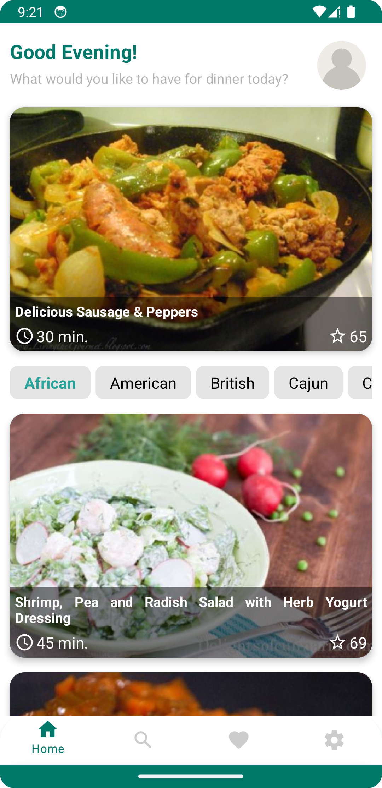
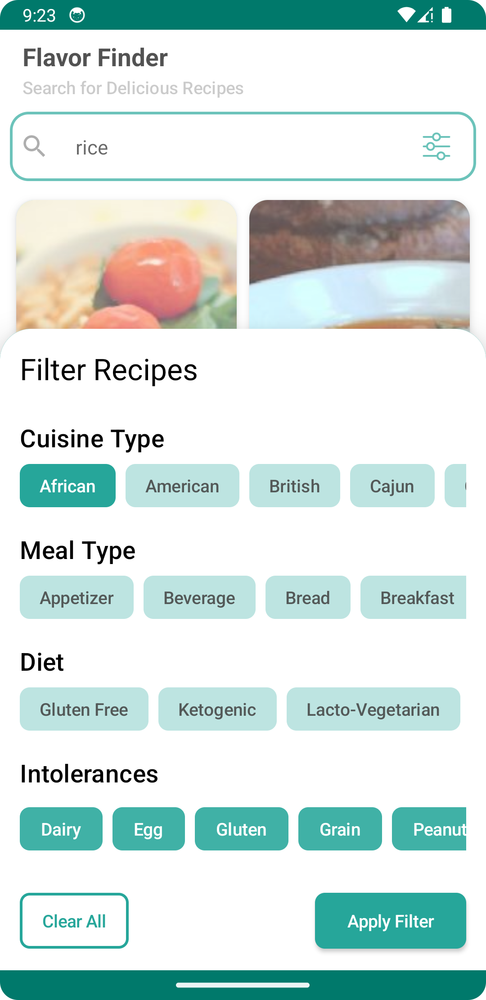
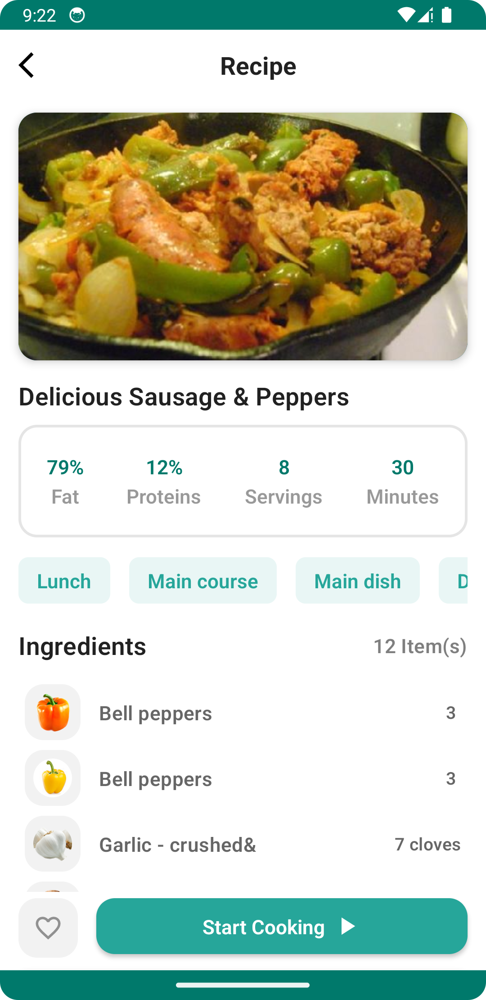
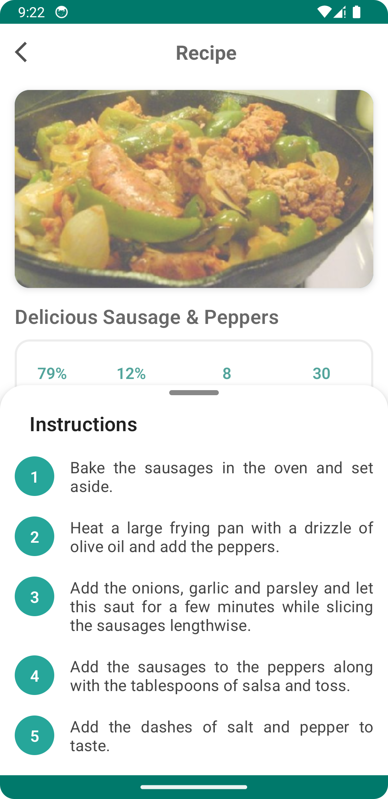
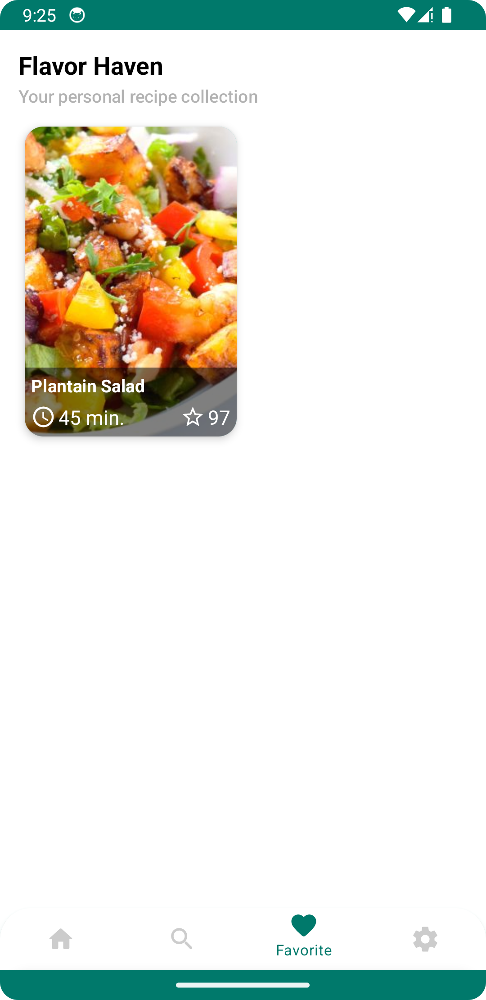
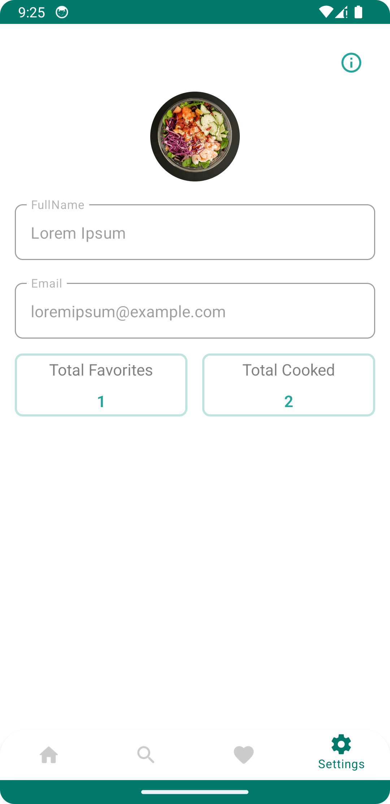
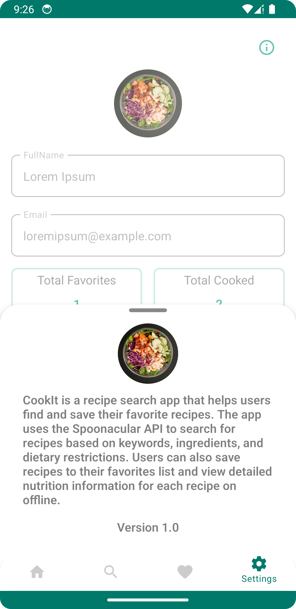

# CookIt

[](https://github.com/Renekakpo/cookIt/actions/workflows/ci.yml)
[](https://github.com/Renekakpo/cookIt/blob/main/LICENSE)

CookIt is an Android recipe app that helps users search, browse and save recipes. It is powered by
the [Spoonacular API](https://spoonacular.com/food-api) — search by keyword, ingredients and dietary
restrictions, read step-by-step cooking instructions and nutrition details, and keep favorites
available offline.

## Features

* Recipe search by keyword, ingredients and dietary restrictions
* Filter recipes by meal type and cuisine
* Detailed recipe view with nutrition information
* Step-by-step cooking instructions
* Save recipes to a favorites list (available offline)
* Settings and About screens

## Tech stack

* **Language:** Kotlin 1.9.10 (JVM toolchain 17)
* **UI:** Jetpack Compose (Compose UI 1.4.3, Material, Material Icons Extended, Navigation Compose 2.5.3, Accompanist)
* **DI:** Hilt 2.48 (+ hilt-navigation-compose)
* **Networking:** Retrofit 2.9.0 with kotlinx-serialization (JSON 1.4.0)
* **Images:** Coil 2.1.0
* **Persistence:** Room 2.5.2 (compiled with KSP) + DataStore Preferences; Room TypeConverters and a DataStore value serialize with Gson 2.9.0
* **Build:** AGP 7.4.0, Gradle 7.5, KSP + kapt
* **SDK:** minSdk 24 · targetSdk 33 · compileSdk 33
* **Testing:** JUnit 4, MockK, Turbine, Truth, kotlinx-coroutines-test

## Architecture

The app follows an offline-first, layered structure under `com.example.cookit`:

```
app/          application entry
data/         repositories, network + offline sources, Resource wrapper
database/     Room database
di/           Hilt modules (DataStore, Database, Network, Repository)
models/       data models
navigation/   Compose navigation graph
network/      Retrofit API service (CookItApiService)
ui/           Compose screens, common components, theme
utils/        helpers
```

Recipe detail is offline-first: the repository exposes a `Flow<Resource<Recipe>>`
that serves the cached copy first, then refreshes from the network, preserving user
state (the "cooked" count) on merge. This single-source-of-truth pattern is scoped to
favorites — a proactive network monitor and caching of non-favorite recipes are
intentionally out of scope (see ADR 0002). The offline-first merge logic is covered by
unit tests (cache/network precedence, offline fallback, state preservation).

Key design decisions are recorded as ADRs in [docs/adr/](docs/adr/):

* [0001 — Use Hilt for dependency injection](docs/adr/0001-use-hilt-for-dependency-injection.md)
* [0002 — Offline-first scope: single source of truth for favorites only](docs/adr/0002-offline-first-scope.md)

## Getting started

1. Clone the repository:
   ```bash
   git clone https://github.com/Renekakpo/cookIt.git
   ```
2. Open the project in Android Studio.
3. Register for a free API key from the [Spoonacular API](https://spoonacular.com/food-api).
4. Add your key to `local.properties` at the project root:
   ```properties
   COOKIT_API_KEY=YOUR_API_KEY_HERE
   ```
   It is exposed to the app through `BuildConfig.COOKIT_API_KEY`.
5. Build and run on an emulator or device.

### Useful commands

```bash
./gradlew lint                # Android lint
./gradlew testDebugUnitTest   # unit tests
./gradlew assembleDebug       # build debug APK
```

## Continuous integration

CI runs on every push and pull request to `develop` and `main` via
[GitHub Actions](.github/workflows/ci.yml) on JDK 17. It runs lint, unit tests and a debug assemble,
and uploads the test and lint reports as build artifacts.

## Screenshots

| | |
|---|---|
|  |  |
|  |  |
|  |  |
|  | |

## Credits

Developed by René Kakpo as a personal project.

## License

Released under the [MIT License](https://github.com/Renekakpo/cookIt/blob/main/LICENSE).
