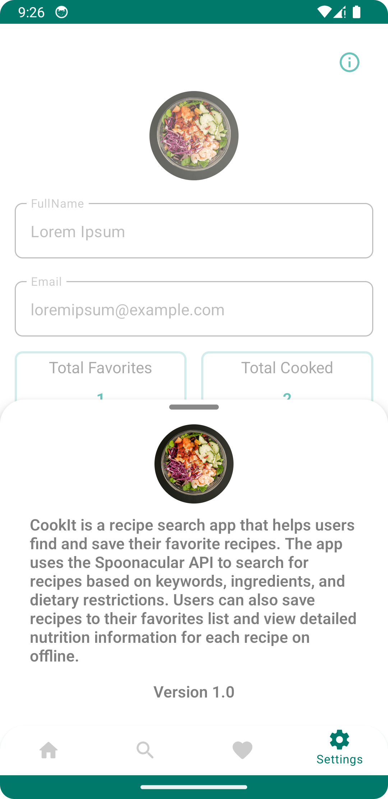

CookIt
============================================

CookIt is a recipe search app that helps users find and save their favorite recipes. The app uses
the [Spoonacular API](https://spoonacular.com/food-api) to search for recipes based on keywords,
ingredients, and dietary restrictions. Users can also save recipes to their favorites list and view
detailed nutrition information for each recipe.

Features
-------------------------------------------

* Recipe search by keyword, ingredients, and dietary restrictions
* Filter recipes by meal type and cuisine
* Save recipes to favorites list
* View detailed nutrition information for each recipe
* User-friendly interface with intuitive navigation

Technologies Used
-------------------------------------------

* Android SDK
* Kotlin programming language
* Android Architecture Components (ViewModel, LiveData)
* Retrofit for API communication
* Picasso for image loading
* Material Design for UI components

Getting Started
------------------------------------------

1. Clone the repository to your local machine:
   `git clone https://github.com/Renekakpo/CookIt.git`

2. Open the project in Android Studio.
3. Register for a free API key from the [Spoonacular API](https://spoonacular.com/food-api) website.
4. Replace the API key in the `gradle.properties` file:
   `COOKIT_API_KEY=YOUR_API_KEY_HERE`

5. Build and run the app on an Android emulator or device.

Screenshots
------------------------------------------

    
    
    
    
    
    
    
    
    
    
    
    

Credits
------------------------------------------
The CookIt app was developed by René Kakpo as a personal project.

License
------------------------------------------
The CookIt app is released under
the [MIT License](https://github.com/Renekakpo/cookIt/blob/main/LICENSE).
